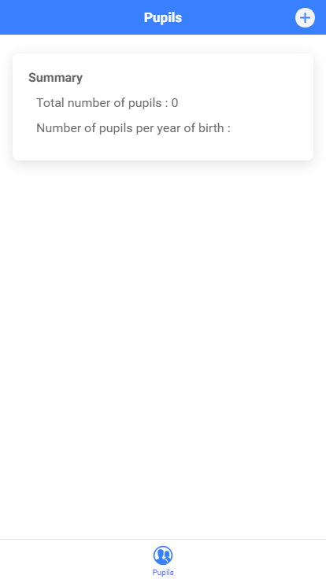

# Kidscare Dev Test

## Introduction

En tant qu'enseignant d'une classe, je souhaite avoir une application qui me permette de gérer mes élèves.
L'application est composée d'un écran qui liste les élèves. Je peux en créer et en supprimer.
En haut de l'écran je dispose d'un encart qui me résume mon listing. 

### Listing

Le listing m'affiche les élèves avec leurs noms, prénoms et dates de naissance **au format dd/MM/yyyy**.
Un bouton sur la droite me permet de supprimer un élève.

### Création

Un élève est composé d'un prénom, d'un nom et d'une date de naissance **au format dd/MM/yyyy**.
La création d'un élève se fait via une modale où chaque champ est obligatoire. Si un champ est manquant, une exception sera levée.
Un élève doit être unique dans la base via son prénom, nom et date de naissance. Une exception sera levée si un doublon est créé.

### Résumé

Un encart me présente plusieurs informations :
* Nombre total d'élèves
* Nombre d'élèves par année de naissance

## Lancement du projet

* Installation de Ionic : `npm install -g ionic`
* Lancement du projet : `ionic serve`
* Lancement des tests unitaires : `npm run test`

## Objectifs du test

Ce projet étant partiellement terminé, c'est à vous de compléter les parties manquantes. Pour cela, vous pouvez vous appuyez sur plusieurs éléments :
* Le descriptif ci-dessus
* Les captures d'écrans de l'interface terminée
* L'exécution complète des tests unitaires **à ne pas modifier**
* L'utilisation de librairie tierce ou module externe est interdite (ex: lodash, underscoreJs, etc)
* N'hésitez pas à proposer des pistes d'améliorations pour l'application

